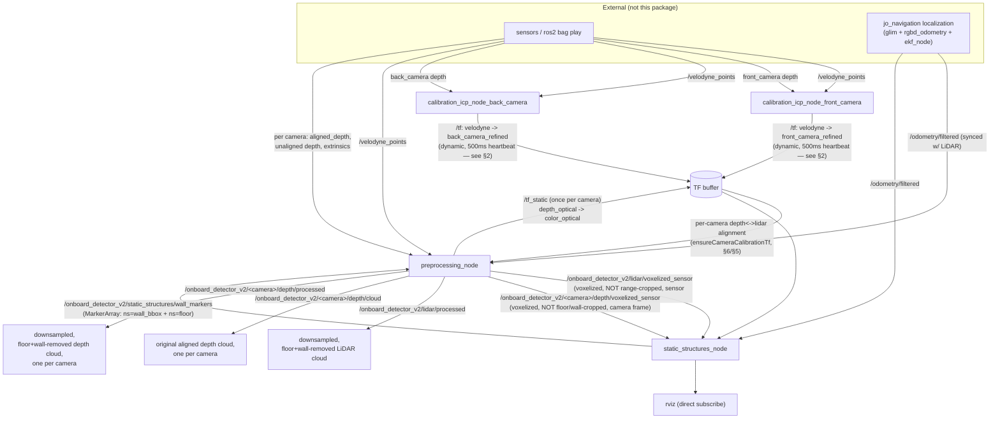

# onboard_detector_v2 — Framework Architecture

This document describes the internal logic of every node in `onboard_detector_v2` as it exists today (Phase 1 of the rewrite — see [`../README.md`](../README.md) for the full phase plan). It's the reference for *what's wired to what and why*; the README explains the phase plan and porting status.

---

## Table of contents

1. [System-level data flow](#1-system-level-data-flow)
2. [calibration_icp_node](#2-calibration_icp_node)
3. [preprocessing_node — overview](#3-preprocessing_node--overview)
4. [LiDAR pipeline (preprocessing_node)](#4-lidar-pipeline-preprocessing_node)
5. [static_structures_node — wall/floor detection](#5-static_structures_node--wallfloor-detection)
6. [Depth pipeline (per camera, N cameras)](#6-depth-pipeline-per-camera-n-cameras)
7. [ROS I/O reference](#7-ros-io-reference)
8. [Config layout](#8-config-layout)
9. [Known limitations / open items](#9-known-limitations--open-items)

---

## 1. System-level data flow

Four kinds of node, all launched together by [`run_detector.launch.py`](../launch/run_detector.launch.py): **one `calibration_icp_node` instance per camera** (`calibration_icp_node_front_camera`, `calibration_icp_node_back_camera`, ... — looped over `camera_names`), one `preprocessing_node`, and one `static_structures_node`. All four are independent, callback-driven ROS2 nodes — no shared executor, no main timer anywhere, every callback does its own work and publishes immediately. `static_structures_node` in particular runs as its own standalone process, asynchronous to everything else, exactly mirroring `onboard_detector`'s own architecture (where `dynamicDetector` and `static_structures_node` are two separate binaries connected only by ROS topics) — `onboard_detector_v2` did NOT have this split until this pass; wall/floor detection used to run inline inside `preprocessing_node`'s own LiDAR callback.

---

## 2. calibration_icp_node

Straight port of `onboard_detector/src/calibration_icp_node.cpp` — same GICP registration via `gtsam_points`, same manual `message_filters::Cache`-based lidar/depth sync (the `zstd` `image_transport` decoder zeroes `header.stamp`, so `message_filters::Synchronizer<ApproximateTime>` never fires — see the comment on `lidar_cache_` in the file). This section covers only what changed from that port, and the I/O surface.

**Run as one instance per camera, not once globally**: `run_detector.launch.py` loops over `camera_names` (read from `preprocessing.yaml`) and launches one `calibration_icp_node` per entry — `calibration_icp_node_front_camera`, `calibration_icp_node_back_camera`, ... — each with that camera's own `depth_topic`/`depth_intrinsics`, `camera_frame_initial_guess` (`<name>_color_optical_frame`), `refined_camera_frame` (`<name>_refined`), and remapped debug topics (`/calibration/<name>/velodyne_points`, `/calibration/<name>/depth_cloud_in_velodyne` — the code's own hardcoded, otherwise-identical-across-instances names). Each instance's YAML parameters are passed as a plain dict, not `ParameterFile(path)`: the cfg's top-level key is `calibration_icp_node:`, which only auto-applies to a node literally named that — since each instance here is renamed per camera, `ParameterFile` would silently miss every yaml value and fall back to the node's own code defaults (found this the hard way: `icp_fitness_threshold` showing up as 0.5, the code default, instead of the cfg's 0.3). This is *why* `front_camera_refined`/`back_camera_refined` exist as separate TFs at all — each camera has its own physical mount offset from the LiDAR, so one shared extrinsic can't be correct for both.

**One behavioral change from the original port**: `publishRefinedTF()` now always sends on the *dynamic* `/tf` topic (never `/tf_static`), and a 500ms heartbeat timer (`onTfHeartbeat()`) re-publishes the same, unchanged result continuously — this used to be periodic-mode-only (`recalibration_period_sec_ > 0`). Reason: a single `/tf_static` send is permanently lost from any listener whose `tf2_ros::Buffer` gets cleared by a backward clock jump — which `ros2 bag play --loop` causes on every loop restart — since nothing ever re-sends it. The heartbeat self-heals that within one tick; the calibration itself still only runs once per instance (one-shot mode unchanged).

**Subscribes** (per instance)

| Topic (param) | Type | Notes |
|---|---|---|
| `lidar_topic` (`/velodyne_points`) | `sensor_msgs/PointCloud2` | raw LiDAR scan — shared across all instances, multiple subscribers is fine |
| `depth_topic` | `sensor_msgs/Image` via `image_transport`, plugin = `depth_transport` | this instance's own camera's stream — for `bags/*_validation_lab` this is the **aligned** depth stream (that bag has no unaligned depth at all) |
| `<lidar_frame> -> <camera_frame_initial_guess>` | TF | initial extrinsic guess for this camera — hand-measured static TF (first camera in `camera_names` only), or (default) the robot/bag's own `<name>_color_optical_frame` TF chain |

**Publishes** (per instance)

| Topic/TF | Type | Notes |
|---|---|---|
| `<lidar_frame> -> <name>_refined` (e.g. `velodyne -> front_camera_refined`) | TF, dynamic `/tf`, sent immediately then every 500ms | this camera's refined extrinsic — see the heartbeat note above |
| debug clouds (lidar overlap / depth-aligned-to-lidar), remapped per camera | `PointCloud2` | for `calibration_icp_debug.rviz` |

**Consumed by**: `static_structures_node`'s own per-camera `ensureCameraCalibrationTf()` (§5, needed to place that camera's detections in `global_frame`) and `preprocessing_node`'s own copy of the same (§6, needed to place that camera's depth-crop points in `global_frame`) — two independent lookups against the same TF, one per consuming node.

---

## 3. preprocessing_node — overview

Sequential, no threading (VLP-16 scan sizes make the single-threaded cost small enough that thread spawn/join overhead isn't obviously worth it — revisit with `ros2 topic bw`/`hz` + `std::chrono` numbers before parallelizing).

Does **not** detect walls or floors itself anymore (see §1) — its job is acquisition, cropping against planes it's *told about*, and re-exposing already-computed voxel grids for `static_structures_node` to consume:

- **LiDAR pipeline** (§4): synced with odometry, produces the general-purpose processed cloud plus a voxelized-but-uncropped sensor-frame republish.
- **Depth pipeline** (§6): one `CameraStream` per entry in the `camera_names` parameter (this robot has two: `front_camera`, `back_camera` — nothing in the code assumes a fixed count or specific names), each fully independent, each contributing its own triplet of published clouds.
- **`onWallMarkers()`** (§4): the async replacement for this file's former inline RANSAC — parses `static_structures_node`'s `MarkerArray` publish back into `wall_planes_global_`/`floor_planes_global_` (one entry per tracked wall / per camera respectively), the two pieces of state both the LiDAR and depth crops filter against.

No calibration gate on the LiDAR path anymore (a difference from an earlier pass of this file, and from before this pass's `static_structures_node` split): `onboard_detector/dynamicDetector` never gated its own `lidarOdomCB` on calibration either, only `static_structures_node`'s own per-camera detection needs each camera's calibration TF (§5). `ensureCameraCalibrationTf` is still used here, for a separate purpose — placing each camera's OWN depth-crop points in `global_frame` (§6).

The LiDAR side owns, and the depth side reads read-only:
- `T_global_base_latest_` — the most recent synced odometry pose (§4, step 3), reused by every camera's depth crop instead of each camera doing its own TF lookup to `global_frame_`.
- `wall_planes_global_`/`floor_planes_global_` — both populated by `onWallMarkers()` (§4), reused by every camera's depth crop to strip points without re-running any detection on depth data itself.

---

## 4. LiDAR pipeline (preprocessing_node)

`onLidarOdom(lidar_msg, odom_msg)`, fired by a `message_filters::Synchronizer<ApproximateTime<PointCloud2, Odometry>>` — this sync works here (unlike calibration's depth sync) because neither LiDAR nor `/odometry/filtered` go through a stamp-destroying codec. `ensureStaticTf()` must first resolve `base_frame -> lidar_frame` (looked up once over TF and cached — the mount is rigid, so this never needs re-querying).

Five passes:

1. **Sensor-frame validity + range crop + two-band voxel-centroid thinning** (`lidar_range_x`/`lidar_range_y`, `lidar_voxel_near`/`lidar_voxel_far`/`lidar_voxel_split_range`) → `local_pts`. This is the general-purpose cloud's own thinning — unrelated to detection, which lives in `static_structures_node` now (§5).
2. **Straight off the raw scan — no crop of any kind, not even step 1's range box — voxel-downsample and publish** on `pub_lidar_voxelized_` (`/onboard_detector_v2/lidar/voxelized_sensor`, `lidar_frame` — sensor frame, not global). This is the ONLY thing `static_structures_node`'s own LiDAR subscription reads (§5) — the expensive voxel-grid pass happens exactly once, here, instead of `static_structures_node` re-acquiring and re-voxelizing raw `/velodyne_points` itself the way `onboard_detector`'s original `wall_detector_node` does. This one change is also what fixes the wall-thickness bug an earlier (single-node) version of this pipeline had — see §5's own note on why a clean, deterministic RANSAC input matters.
3. **Global-frame transform** — `T_global_lidar = T_global_base (synced odom) × T_base_lidar (cached)`, one 4×4 matrix multiply, no TF lookup per point or per callback. `T_global_base_latest_` is cached here for the depth pipeline to reuse (§6).
4. **`local_pts` → global frame + slope-aware floor/roof crop, in one loop.** `heightAboveGround(p)` bounded to `[wall_removal_margin, ground_roof_offset]` — the MINIMUM `signedDistance` across every camera's own `ax+by+cz+d=0` plane in `floor_planes_global_` (received from `static_structures_node` via `onWallMarkers()`, §5 — not fit in this file; one plane per camera, not a single shared one — see §5), so a sloped floor tilts the crop instead of clipping it at a fixed world-Z height, and the ground is the UNION of the space below every camera's plane (taking the min across planes is exactly that union — see `heightAboveGround()`'s own comment). The lower bound is `wall_removal_margin`, not `0` — a real floor-surface point's `signedDistance` sits close to zero on *either* side (RANSAC fits the plane roughly through its inliers, not strictly above them), so a plain `h < 0` test only drops the roughly-half of floor points that end up marginally below the fit and leaves the rest in the cloud; the margin drops anything close to the floor plane at all, symmetric to `isNearAnyWall`'s own margin-gated wall strip. Then voxel-downsample the result.
5. **Strip points near any `wall_planes_global_` entry** (also received via `onWallMarkers()` — the *tracked* set `static_structures_node`'s own `WallBBoxRegistry` maintains, not necessarily this exact instant's fresh detections, since the two nodes run on independent cadences) and publish on `/onboard_detector_v2/lidar/processed`, `frame_id = global_frame`.

**`onWallMarkers(msg)`**: subscribes to `/onboard_detector_v2/static_structures/wall_markers` (§5's output). Mirrors `onboard_detector/dynamicDetector`'s own `wallMarkersCB` exactly for the wall half (parses each `ns="wall_bbox"` `CUBE`'s position/orientation/scale back into a plane: `normal = rotation.col(0)`, `d = -normal·center`), and generalizes it to also recover EVERY camera's own floor plane, one per `ns="floor"` marker `static_structures_node` adds (one per camera — see §5) — each encoded losslessly via the marker's local +Z axis (`normal`) and position (a point on the plane, so `d = -normal·position`), collected into `floor_planes_global_`. Only overwrites that vector wholesale when the incoming set of `floor` markers is non-empty (defensive; `static_structures_node` always includes at least one once any camera has an estimate).

---

## 5. static_structures_node — wall/floor detection

[`src/static_structures_node.cpp`](../src/static_structures_node.cpp) — standalone executable, own `rclcpp::Node`, own `rclcpp::spin()`. Architecturally a faithful port of `onboard_detector/scripts/wall_detector/wallDetector.{h,cpp}`: same iterative RANSAC (`fitPlane3`/`findPlaneInliers`/`ransacOnePlane`, including the confidence-based early-stop iteration formula), same PCA `refitPlane`, same `WallBBoxRegistry` persistent tracking ([`include/onboard_detector_v2/wall_registry.hpp`](../include/onboard_detector_v2/wall_registry.hpp), shared with — well, now solely owned by — this node), same "detect in the sensor's own frame, transform only the small set of FOUND boxes/planes afterward" design as the original's `pointCloudCallback`.

Two deliberate differences from the original, both explicit in the file's own header comment:

1. **Point acquisition, not detection logic.** The original subscribes directly to raw `/velodyne_points` (and a raw depth image, only for a flat ground-height estimate) and voxel-filters them itself every scan. This node instead subscribes to `preprocessing_node`'s own already-voxel-downsampled — but deliberately NOT range/ground-cropped — LiDAR and per-camera depth clouds (§4 step 2, §6). The expensive voxel-grid pass happens exactly once, in `preprocessing_node`, and both this node and the general-purpose processed-cloud output reuse it, instead of each node repeating its own separate acquisition+voxelization of the same raw sensor data. Range cropping still happens here (own `lidar_range_x`/`lidar_range_y` params, on the already-downsampled centroids — cheap regardless of value); the camera side needs no extra range crop, since `preprocessing_node`'s own `depth_min_value`/`depth_max_value` already bound it upstream.
2. **Floor is a real, potentially-tilted plane — one PER CAMERA, not a single shared estimate** — fit by the SAME RANSAC engine that finds walls (near-horizontal classification), not the original's separate depth-image bottom-rows RANSAC on `z=c` (flat only — the original never ran wall RANSAC on depth at all, only this one flat ground estimate). Each is transformed to `global_frame` and EMA-tracked (`floor_ema_alpha`) exactly the way a wall's box is — normal + `d` instead of 8 corners, same "detect in sensor frame, transform the small result, not the point cloud" idea (`transformPlane()`, the plane-equation equivalent of `WallBBox::transform()`) — but each camera's own plane only ever blends with ITS OWN previous detections (`CameraSource::floor_plane_global`), never with another camera's. `preprocessing_node` then treats the *union* of the space below every camera's plane as "the ground" (see §4's `heightAboveGround()`) rather than forcing one compromise plane that might fit neither camera's actual view well.

**Detection is explicitly split by source**, not shared: LiDAR only ever looks for walls, every camera only ever looks for floor. `detectFromSensorPoints(pts, T_global_sensor, detect_walls, detect_floor)` computes `up_sensor = T_global_sensor.linear()ᵀ · UnitZ` (world-up expressed in that source's own frame — the sensor-frame generalization of "normal.z() means vertical", same as the original's `up_lidar`), then runs iterative RANSAC (up to `max_planes` planes): each extracted plane's PCA-refit normal classifies as a wall (`isWallPlane`, within `wall_vertical_angle_deg` of `up_sensor`'s perpendicular — a wall box is built via `buildBoxFromPlane`, compactness-checked via `wall_bbox_max_aspect_ratio`, and immediately `.transform()`-ed into `global_frame`) only if `detect_walls` is set, or, if not yet found this pass, a floor candidate (`isFloorCandidate`, within `floor_max_tilt_deg` of `up_sensor` — oriented toward `up_sensor` then `transformPlane()`-ed into `global_frame`) only if `detect_floor` is set — a plane matching a disabled category is simply discarded (RANSAC still keeps extracting from what's left regardless, since `ransacOnePlane()` strips each plane's inliers from `pts` unconditionally). Called independently from:
- `onLidarVoxelized(msg)` — LiDAR's own voxelized-sensor topic, own range crop, `T_global_lidar = T_global_base_latest_ × T_base_lidar_`, `detect_walls=true, detect_floor=false`. Reasoning: the LiDAR's 360°, consistent-height scan is the better source for vertical wall planes across the whole range.
- `onCameraVoxelized(cam, msg)` — one subscription per `camera_names` entry, `T_global_cam = T_global_base_latest_ × T_base_lidar_ × cam.T_lidar_camera` (that camera's own calibration TF, `ensureCameraCalibrationTf` — gates this specific callback until ready, unlike the LiDAR path which has no calibration dependency at all), `detect_walls=false, detect_floor=true`. Reasoning: a downward-angled depth camera sees the floor immediately ahead at far higher density than the LiDAR's own sparse near-field rings — what actually matters for catching a slope early.

This is a deliberate choice, not a technical limitation of `detectFromSensorPoints` itself — nothing stops a camera from also reporting a wall it sees that the LiDAR's own crop missed ("more viewpoints = more evidence"), the flags are just set to not do that right now.

**Merging** (`mergeDetection(det, floor_source)`): folds one source's fresh wall detections into the SHARED registry state (`wall_registry_->mergeNested()` + `->update()` — same match/merge/expiry semantics as `onboard_detector`'s registry: a fresh box matches an existing entry by IoU gated on normal alignment + center distance, merges in rather than replacing, an unmatched existing entry survives via `missed_frames` until it exceeds `wall_max_missed_frames`), and — when `floor_source` is non-null (every camera call passes `&cam`; the LiDAR call passes `nullptr`, since it never detects floor at all) — EMA-blends a found floor candidate into THAT camera's own `cam.floor_plane_global`, never any other camera's. Faithfully keeps one original quirk: `wall_registry_->update()` (and therefore all expiry bookkeeping) is only invoked when THIS callback found at least one wall — a totally-empty detection from one source doesn't advance expiry either, same as the original.

**Why tracked walls don't grow unrealistically thick** (the reason this whole split exists, beyond matching the original's architecture): `WallBBoxRegistry::merge()`'s union-bounding-box is correct for a wall's length/height (legitimate growth as more of it comes into view) but was historically wrong for thickness — `rotation` is frozen at the first detection, so ANY per-scan orientation difference (even after `refitPlane`'s PCA stabilization) got unioned onto the thickness axis forever, amplified further by a long wall's Y/Z extent projected through even a small angle (13 m × sin(15°) ≈ 3.4 m). Fixed in `wall_registry.hpp`'s `merge()`: thickness is EMA-blended (`wall_merge_weight` — the first real use of that parameter, unused in both the original and earlier passes of this port) using the incoming box's OWN local thickness, never rotated into the existing box's frame, so no length-times-angle amplification. Length/height stay union, still legitimately growing.

**Publishes**: `/onboard_detector_v2/static_structures/wall_markers` (`visualization_msgs/MarkerArray`, `global_frame`) — `ns="wall_bbox"`: one `CUBE` per tracked wall (position=center, orientation=rotation, scale=size — the original's exact wire format, which `dynamicDetector`'s `wallMarkersCB` and this package's `preprocessing_node::onWallMarkers` both parse back into planes, not just visualize). `ns="floor"`: one `CUBE` slab PER CAMERA that has an estimate yet (`id` = that camera's index in `cameras_`, a small fixed hue cycle so overlapping planes stay visually distinguishable in rviz), each encoding that camera's own `cam.floor_plane_global` (orientation's local +Z axis is the plane normal via `Eigen::Quaterniond::FromTwoVectors(UnitZ, normal)`, position is a point on the plane solved at the robot's current (x,y) — so it tilts visibly on sloped terrain). Fires from whichever `mergeDetection()` call happens to run — LiDAR at ~10Hz, each camera at ~30Hz, so this topic actually publishes at roughly their combined rate.

**Consumed by**: `preprocessing_node::onWallMarkers()` (§4) and rviz directly (`preprocessing_debug.rviz`'s "Detected Planes" display).

---

## 6. Depth pipeline (per camera, N cameras)

`camera_names` (default `["front_camera"]`, this robot's cfg sets `["front_camera", "back_camera"]`) drives a loop in the constructor (`setupCamera`) that builds one `CameraStream` per name — a private struct holding that camera's parameters, decoded intrinsics, cached TF, subscriptions and publishers. Nothing in the rest of the file assumes a specific count or specific names; adding a third camera is a one-line cfg change (`camera_names: [..., "side_camera"]`), no code change, as long as it publishes the same three streams below under `/<name>/camera/...` (the parameter defaults are built from `name`, so a camera that follows that topic-naming convention needs no per-key overrides at all — only the actual per-bag difference, `aligned_depth_transport: zstd`, is set explicitly in cfg for either camera today).

Each camera has three independent input streams, each on its own `camera_info` (own intrinsics, never mixed up within a camera or shared across cameras):

1. **Unaligned depth** (`depth_topic`) — subscribed and decoded (`onRawDepth`) but not deprojected; reserved for the future UV-map detection stage (Phase 2), which will work on the depth image directly. No publisher yet.
2. **Aligned depth** (`aligned_depth_topic`, `aligned_depth_camera_info_topic` = the **color** camera's own `camera_info` — aligned depth lives in the color image's pixel grid) — `processAlignedDepth(cam, msg)` decodes the image and deprojects to a point cloud using `cam.fx_aligned`/... (never `cam.fx_depth`/..., never another camera's intrinsics). **OR**, if `<name>.aligned_depth_cloud_topic` is set (empty/unset by default), that decode+deprojection is skipped entirely and `onNativeDepthCloud(cam, msg)` reads an already-deprojected `PointCloud2` straight from that topic instead — some drivers publish one themselves (e.g. RealSense's own `pointcloud` filter, `<name>/camera/depth/color/points` in `bags/*_validation_lab`), and there's no reason to decode an image and reconstruct a cloud when the input already is one. `pcl::fromROSMsg` extracts just the `x`/`y`/`z` fields it needs, ignoring any extra ones (e.g. an `rgb` field) the source carries; the only real work left is the same `depth_min_value`/`depth_max_value` range filter the image path's per-pixel loop applies, tested against each point's own `z`.

   The one real difference between the two: a native cloud arrives in **this camera's own `depth_optical_frame`** (its own intrinsics), not `color_optical_frame` like the aligned-depth path — confirmed by actually inspecting both in `bags/*_validation_lab` (the aligned-depth image reports `frame_id: front_camera_color_optical_frame`; the native cloud reports `front_camera_depth_optical_frame`). Both paths converge into **`finishDepthCloud(cam, cloud, stamp, frame_id, is_native_depth_frame)`**, shared:
   - Publishes `cloud` as-is on `/onboard_detector_v2/<name>/depth/cloud` ("original"), in whichever frame it actually arrived in.
   - Voxel-downsamples it (`voxel_resolution`, shared value with the LiDAR path) → `depth_downsampled`, and republishes THAT, as-is, on `/onboard_detector_v2/<name>/depth/voxelized_sensor` — zero extra compute either way, and it's the ONLY thing `static_structures_node`'s per-camera subscription reads (§5).
   - Decides what to keep from `depth_downsampled` using a **global-frame copy** of each surviving point, dropping points where `heightAboveGround(p)` falls outside `[wall_removal_margin, ground_roof_offset]` (§4's `floor_planes_global_`, one received plane per camera, unioned via the min-across-planes trick — see §4 step 4/§5 — not a single shared floor plane) or within `wall_removal_margin` of a `wall_planes_global_` entry (also received). The *published* cloud stays in the original frame throughout; only the removal decision needs the global-frame position. Published on `/onboard_detector_v2/<name>/depth/processed`.

   `is_native_depth_frame` is what makes the crop's global-frame transform correct for either source (see the next paragraph).
3. **Depth↔color extrinsics** (`depth_to_color_extrinsics_topic`, `realsense2_camera_msgs/msg/Extrinsics`) — `onDepthToColorExtrinsics(cam, msg)` rebroadcasts once as a static TF, `<name>_depth_optical_frame -> <name>_color_optical_frame`, so any other node can use a normal TF lookup instead of this RealSense-specific message, and ALSO caches the same rotation/translation directly as `cam.T_depth_color` (an `Eigen::Matrix4d`) for `finishDepthCloud`'s own use (see below) — no separate TF lookup needed there. **Unverified assumption** (flagged in the file header): the rotation matrix is column-major, matching `librealsense`'s own `rs2_extrinsics` convention — if a camera's rebroadcast TF looks mirrored/transposed, this is the first place to check.

**Getting each camera's depth cloud into `global_frame_` — calibration, not the raw TF chain.** The global-frame transform composition prefers `T_global_base_latest_ × T_base_lidar_ × T_lidar_frame`, where `T_lidar_frame` starts as `cam.T_lidar_camera` — **this specific camera's own** `lidar_frame -> <name>_refined` TF (§2's per-camera `calibration_icp_node` instance output, cached once via `ensureCameraCalibrationTf` — same lazy-resolve-once-then-assume-rigid pattern as `ensureBaseDepthTf`, see its own comment for the one caveat: a periodic-recalibration `calibration_icp_node` would need this invalidated to pick up a refined estimate, which isn't done). That's the actual lidar<->depth alignment this whole package calibrates — but it was calibrated against points deprojected via the **color**-frame convention (`processAlignedDepth`'s own path, what `calibration_icp_node` itself also uses internally), so a **native** cloud (in `depth_optical_frame`) needs one extra step first: `T_lidar_frame = cam.T_lidar_camera × cam.T_depth_color⁻¹`, bringing a depth-frame point into that same color-frame convention before the calibrated transform applies to it — otherwise every point would be off by the RealSense factory depth↔color extrinsic's own translation (a few cm, not negligible against `wall_removal_margin`). `finishDepthCloud`'s `is_native_depth_frame` flag is exactly what selects this extra step (and gates using the calibrated path at all until `cam.T_depth_color` has actually been received once). Before the calibrated TF is available at all (or if it's never resolved), this falls back to `cam.T_base_depth` (base_frame → this camera's own depth-cloud frame, cached once via `ensureBaseDepthTf`, lazily resolved once that camera's first depth message reveals its `frame_id`) — the robot's own raw URDF/bag TF chain, uncalibrated, and needing no such correction since it's a direct `base_frame_ -> frame_id` lookup regardless of which frame_id that happens to be.

**Why `T_global_base_latest_`, not a TF lookup to `global_frame_`**: this was tried first (`tf_buffer_->lookupTransform(global_frame_, depth_frame, ...)`), and requires something — `ekf_node`, in the `jo_navigation` localization stack — reliably broadcasting `global_frame_ -> base_frame_` over TF specifically, not just publishing `/odometry/filtered` as a topic. Empirically, that TF broadcast was not reliably available even when the topic itself was publishing fine. Reusing the LiDAR path's own most-recently-synced odom pose sidesteps that dependency entirely — depth arrives faster than LiDAR (~30Hz vs ~10Hz) and unsynced, so this is at most one LiDAR period stale, which is fine for a floor/wall crop. `static_structures_node` makes exactly the same choice for exactly the same reason (its own `T_global_base_latest_`, from its own `/odometry/filtered` subscription).

**Camera-to-camera independence**: both `cam.T_lidar_camera` and the `cam.T_base_depth` fallback are per-`CameraStream`, so two cameras with different mounting offsets, different calibration results, and different frame names never interfere with each other; each camera's crop uses only its own cached transform(s) composed with the one shared `T_global_base_latest_`/`T_base_lidar_`.

---

## 7. ROS I/O reference

| Topic | Type | Frame | Published by |
|---|---|---|---|
| `/onboard_detector_v2/lidar/processed` | `PointCloud2` | `global_frame` (`odom`) | preprocessing_node, §4 |
| `/onboard_detector_v2/lidar/voxelized_sensor` | `PointCloud2` | `lidar_frame` (sensor) | preprocessing_node, §4 — read by static_structures_node |
| `/onboard_detector_v2/static_structures/wall_markers` | `MarkerArray` | `global_frame` | static_structures_node, §5 — read by preprocessing_node + rviz |
| `/onboard_detector_v2/<camera>/depth/cloud` | `PointCloud2` | camera's own optical frame | preprocessing_node, §6, one per camera |
| `/onboard_detector_v2/<camera>/depth/processed` | `PointCloud2` | camera's own optical frame | preprocessing_node, §6, one per camera |
| `/onboard_detector_v2/<camera>/depth/voxelized_sensor` | `PointCloud2` | camera's own optical frame | preprocessing_node, §6 — read by static_structures_node |
| `<lidar_frame> -> <camera>_refined` | TF (dynamic `/tf`) | — | calibration_icp_node, §2, one per camera (e.g. `front_camera_refined`, `back_camera_refined`) |
| `<camera>_depth_optical_frame -> <camera>_color_optical_frame` | TF (static `/tf_static`) | — | preprocessing_node, §6, one per camera |

| Topic | Type | Consumed by |
|---|---|---|
| `/velodyne_points` | `PointCloud2` | calibration_icp_node instances, preprocessing_node |
| `/odometry/filtered` | `nav_msgs/Odometry` | preprocessing_node (synced with LiDAR), static_structures_node (own subscription) |
| `<camera> depth/aligned-depth/extrinsics streams` | various | calibration_icp_node (one camera per instance), preprocessing_node (every camera in `camera_names`) |

---

## 8. Config layout

`cfg/<env>/{calibration_icp,preprocessing,static_structures}.yaml` — one environment folder selected per launch (`env:=indoor|outdoor`), applied to every node. `preprocessing.yaml`'s `camera_names` list plus one sub-tree per name (`front_camera:`, `back_camera:`, ...) is the only nested structure there; `static_structures.yaml` has its own `camera_names` default too, but `run_detector.launch.py` always overrides it from `preprocessing.yaml`'s own list (read once, passed to both) so the two configs can never disagree about which cameras exist. Every other key in every file is flat. `run_detector.launch.py`'s own launch args override specific calibration keys at launch time without editing cfg — see that file's own comments.

---

## 9. Known limitations / open items

- **No UV-map / segmentation detection yet** — Phase 2. The unaligned depth stream (per camera) is already wired and decoding correctly end to end, waiting for that stage to subscribe to it.
- **Per-camera calibration TF is cached once, never invalidated** — see §6's `ensureCameraCalibrationTf` callout: a `calibration_icp_node` running in periodic recalibration mode (`recalibration_period_sec > 0`) would keep publishing an updated `<name>_refined` TF, but neither `preprocessing_node` nor `static_structures_node` would ever pick up the refinement after their own first successful lookup.
- ~~`camera_depth_intrinsics` is a manual, easy-to-drift substitute~~ — fixed: `run_detector.launch.py`'s calibration loop no longer raises on a `camera_names` entry missing from that map, it just omits the `depth_intrinsics` override for that instance (falls back to `calibration_icp_node.cpp`'s own generic default, immediately overwritten by that camera's live `camera_info` anyway — see §2) and logs a one-time warning instead. Adding a camera is now genuinely a one-line `camera_names` edit in `preprocessing.yaml`, full stop; `camera_depth_intrinsics` is purely an optional, tighter-bootstrap convenience.
- **`--loop` bag playback has a second, unresolved failure mode**: a backward clock jump (every loop restart) can leave `message_filters::Synchronizer<ApproximateTime<...>>`'s internal queues confused, silently halting `preprocessing_node::onLidarOdom` until enough new in-order data arrives (observed: it did not recover on its own within ~90s in one test). The `/tf` heartbeat (§2) fixes the *TF* half of the `--loop` problem; this synchronizer-side half is separate and still open. `static_structures_node` doesn't use `message_filters` at all (plain independent subscriptions), so it isn't directly affected, but obviously produces nothing new once `preprocessing_node`'s LiDAR path is stuck (its LiDAR-sourced detections stop; camera-sourced ones keep going since depth isn't synced either way).
- **No thread parallelism** in either node (deliberately, for now — see §3).
